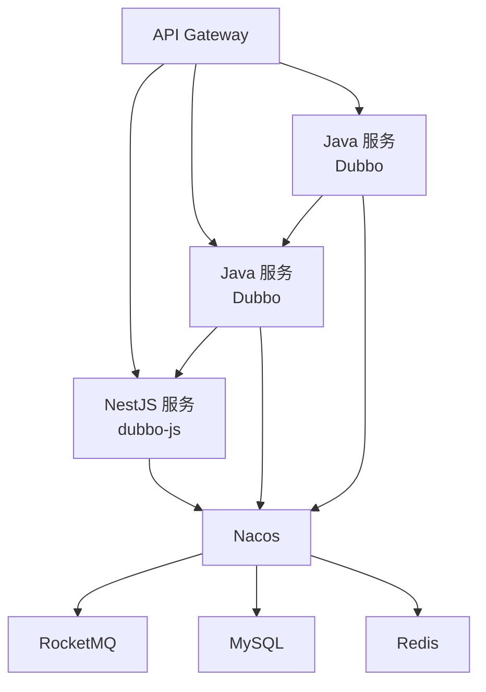

# NestJS工程编码规范

## 核心框架

| 属性 | 值 |
|------|-----|
| 版本 | v10.0.0 - v10.4.1 |
| 用途 | Node.js 企业级框架，微服务支持 |

| 模块 | 说明 |
|------|------|
| @nestjs/common | 核心装饰器和工具 |
| @nestjs/core | 依赖注入容器 |
| @nestjs/platform-express | Express 平台适配器 |
| @nestjs/microservices | 微服务支持 |
| @nestjs/config | 配置管理 |
| @nestjs/swagger | API 文档生成 |
| @nestjs/throttler | 请求限流 |
| @nestjs/schedule | 定时任务调度 |
| @nestjs/axios | HTTP 客户端 |
| @nestjs/mapped-types | DTO 映射工具 |

| 依赖 | 说明 |
|------|------|
| reflect-metadata | 元数据反射（装饰器必需） |
| rxjs | 响应式编程库 |

---

## 编程语言

| 语言 | 版本 | 属性 |
|------|------|------|
| TypeScript | v5.0.0 - v5.1.3 | 编译目标 ES2021，模块系统 CommonJS |
| Node.js | v20.x+ | LTS 运行时 |

---

## 包管理

| 属性 | 值 |
|------|-----|
| 工具 | pnpm (Latest) |
| 配置 | pnpm-workspace.yaml |
| 国内镜像 | `pnpm config set registry https://registry.npmmirror.com` |

---

## 微服务架构

| 属性 | 值 |
|------|-----|
| 协议 | TCP |
| 序列化 | JSON |
| 传输 | @nestjs/microservices TCP Transport |

### 服务发现

| 属性 | 值 |
|------|-----|
| 工具 | Nacos v2.6.0 |
| 功能 | 服务注册与发现、配置管理、负载均衡、健康检查 |

### 服务间通信

| 场景 | 方式 |
|------|------|
| NestJS 内部 | `this.serviceClient.send({ cmd: 'command_name' }, payload)` |
| 跨语言（Dubbo RPC） | @apache/dubbo-js，Triple 协议，HTTP/1、HTTP/2 传输 |

```typescript
// src/adapter/rpc/user.rpc.ts
@Injectable()
export class UserRpcAdapter {
  private dubbo: Dubbo;

  constructor() {
    this.dubbo = new Dubbo({
      registry: 'nacos://localhost:8848',
      services: { UserService: { version: '1.0.0', group: 'user-service' } },
    });
  }

  async findById(id: string) {
    return await this.dubbo.getService('UserService').findById({ id });
  }
}
```

---

## 消息队列

| 属性 | 值 |
|------|-----|
| SDK | rocketmq-client-nodejs / ali-ons |
| 消息类型 | 普通、顺序、延迟、事务 |

### Topic/Tag 命名规范

| 类型 | 格式 | 示例 |
|------|------|------|
| Topic | `{业务域}_{消息类型}_TOPIC` | `ORDER_EVENT_TOPIC` |
| Tag | `{具体事件}_TAG` | `ORDER_CREATED_TAG` |

```typescript
// src/infra/mq/rocketmq.provider.ts
export const ROCKETMQ_PRODUCER = 'ROCKETMQ_PRODUCER';

export const rocketmqProviders = [{
  provide: ROCKETMQ_PRODUCER,
  useFactory: async () => {
    const producer = new Producer({ endpoints: 'localhost:8081' });
    await producer.startup();
    return producer;
  },
}];

// src/adapter/mq/order-event.consumer.ts
@Injectable()
export class OrderEventConsumer implements OnModuleInit, OnModuleDestroy {
  private consumer: SimpleConsumer;

  async onModuleInit() {
    this.consumer = new SimpleConsumer({
      endpoints: 'localhost:8081',
      consumerGroup: 'CID_USER_SERVICE',
    });
    await this.consumer.subscribe('ORDER_EVENT_TOPIC');
    await this.consumer.startup();
  }

  async onModuleDestroy() { await this.consumer?.shutdown(); }
}
```

---

## 缓存

| 属性 | 值 |
|------|-----|
| SDK | ioredis v5.3.0+ |
| 集成 | @nestjs/cache-manager |

### Key 命名规范

| 规则 | 格式 | 示例 |
|------|------|------|
| 缓存 Key | `{业务域}:{对象}:{标识}` | `user:info:12345` |
| 加锁 Key | `{业务域}:lock:{操作}:{标识}` | `order:lock:create:order_123` |

```typescript
// src/infra/cache/redis.provider.ts
export const REDIS_CLIENT = 'REDIS_CLIENT';

export const redisProviders = [{
  provide: REDIS_CLIENT,
  useFactory: () => new Redis({
    host: process.env.REDIS_HOST,
    port: parseInt(process.env.REDIS_PORT),
    password: process.env.REDIS_PASSWORD,
  }),
}];

// src/infra/cache/cache.service.ts
@Injectable()
export class CacheService {
  constructor(@Inject(REDIS_CLIENT) private redis: Redis) {}

  async get<T>(key: string): Promise<T | null> {
    const value = await this.redis.get(key);
    return value ? JSON.parse(value) : null;
  }

  async set(key: string, value: any, ttl = 60): Promise<void> {
    await this.redis.setex(key, ttl, JSON.stringify(value));
  }

  async del(key: string): Promise<void> { await this.redis.del(key); }
}
```

---

## 分布式锁

```typescript
// src/infra/lock/distributed-lock.service.ts
@Injectable()
export class DistributedLockService {
  constructor(@Inject(REDIS_CLIENT) private redis: Redis) {}

  async acquire(key: string, ttl = 10000): Promise<boolean> {
    return (await this.redis.set(key, '1', 'PX', ttl, 'NX')) === 'OK';
  }

  async release(key: string): Promise<void> { await this.redis.del(key); }

  async withLock<T>(key: string, ttl: number, fn: () => Promise<T>): Promise<T> {
    if (!(await this.acquire(key, ttl))) throw new LockAcquireFailedException(key);
    try { return await fn(); }
    finally { await this.release(key); }
  }
}

// 使用示例
await this.lockService.withLock(`order:lock:create:${orderId}`, 10000, 
  async () => { await this.orderService.createOrder(dto); });
```

---

## ORM 框架

| 框架 | 版本 | 特点 |
|------|------|------|
| TypeORM | v0.3.0+ | @nestjs/typeorm 集成，MySQL/PostgreSQL |
| Prisma | v5.0+ | 类型安全、自动生成客户端（备选） |

```typescript
// src/infra/database/database.module.ts
@Module({
  imports: [
    TypeOrmModule.forRootAsync({
      useFactory: () => ({
        type: 'mysql',
        host: process.env.DB_HOST,
        port: parseInt(process.env.DB_PORT),
        username: process.env.DB_USER,
        password: process.env.DB_PASSWORD,
        database: process.env.DB_NAME,
        entities: [__dirname + '/../**/*.entity{.ts,.js}'],
        synchronize: false,
      }),
    }),
  ],
})
export class DatabaseModule {}
```

---

## 限流与熔断

### 请求限流

| 属性 | 值 |
|------|-----|
| 模块 | @nestjs/throttler |
| 存储 | Redis（分布式） |

```typescript
// src/app.module.ts
@Module({
  imports: [
    ThrottlerModule.forRoot([
      { name: 'short', ttl: 1000, limit: 3 },
      { name: 'medium', ttl: 10000, limit: 20 },
      { name: 'long', ttl: 60000, limit: 100 },
    ]),
  ],
})
export class AppModule {}

// controller 使用
@Controller('users')
@Throttle({ default: { limit: 10, ttl: 60000 } })
export class UsersController {}
```

### 熔断器

```typescript
// src/infra/circuit-breaker/circuit-breaker.service.ts
@Injectable()
export class CircuitBreakerService {
  private failures = new Map<string, number>();
  private lastFailureTime = new Map<string, number>();
  private readonly failureThreshold = 5;
  private readonly resetTimeout = 30000;

  async execute<T>(key: string, fn: () => Promise<T>): Promise<T> {
    if (this.isOpen(key)) throw new CircuitBreakerOpenException(key);
    try {
      const result = await fn();
      this.reset(key);
      return result;
    } catch (error) {
      this.recordFailure(key);
      throw error;
    }
  }

  private isOpen(key: string): boolean {
    const failures = this.failures.get(key) || 0;
    if (failures >= this.failureThreshold) {
      const lastFailure = this.lastFailureTime.get(key) || 0;
      return Date.now() - lastFailure < this.resetTimeout;
    }
    return false;
  }

  private recordFailure(key: string): void {
    this.failures.set(key, (this.failures.get(key) || 0) + 1);
    this.lastFailureTime.set(key, Date.now());
  }

  private reset(key: string): void {
    this.failures.delete(key);
    this.lastFailureTime.delete(key);
  }
}
```

---

## 异步处理

### 任务队列

| 属性 | 值 |
|------|-----|
| 模块 | Bull / BullMQ |
| 存储 | Redis |

```typescript
// src/app.module.ts
@Module({
  imports: [
    BullModule.forRoot({ redis: { host: process.env.REDIS_HOST, port: parseInt(process.env.REDIS_PORT) } }),
    BullModule.registerQueue({ name: 'email' }),
  ],
})
export class AppModule {}

// src/infra/queue/email.processor.ts
@Processor('email')
export class EmailProcessor {
  @Process('send')
  async handleSend(job: Job<SendEmailDto>) { await this.emailService.send(job.data); }
}
```

### 定时任务

| 属性 | 值 |
|------|-----|
| 模块 | @nestjs/schedule |
| Cron 表达式 | 支持 |

```typescript
// src/adapter/job/sync.job.ts
@Injectable()
export class SyncJob {
  @Cron('0 0 2 * * *')  // 每天凌晨2点
  async syncUsers() { await this.userService.syncFromExternal(); }

  @Interval(5000)  // 每5秒
  async checkHealth() { await this.healthService.check(); }
}
```

---

## 链路追踪

| 属性 | 值 |
|------|-----|
| SDK | @opentelemetry/sdk-node |
| 导出 | Jaeger / Zipkin / OTLP |

```typescript
// src/main.ts
import { NodeSDK } from '@opentelemetry/sdk-node';

const sdk = new NodeSDK({
  serviceName: 'user-service',
  traceExporter: new OTLPTraceExporter(),
});

sdk.start();
```

---

## 与 Java 服务集成



### 集成检查清单

| 组件 | Java | NestJS | 状态 |
|------|------|--------|------|
| 注册中心 | Nacos | Nacos | ✅ 共用 |
| RPC 协议 | Dubbo Triple | dubbo-js Triple | ✅ 互通 |
| 消息队列 | RocketMQ | rocketmq-client-nodejs | ✅ 共用 |
| 缓存 | Redis | ioredis | ✅ 共用 |
| 数据库 | MySQL | TypeORM | ✅ 共用 |
| 链路追踪 | SkyWalking | OpenTelemetry | ⚠️ 需适配 |
| 限流熔断 | Sentinel | @nestjs/throttler | ➖ 自研 |

---

## 日志

| 工具 | 版本 | 用途 |
|------|------|------|
| Winston | v3.17.0 | 多传输目标、日志级别管理 |
| nest-winston | v1.9.7 | NestJS 集成 |
| source-map | v0.7.4 | Source Map 解析 |
| source-map-support | v0.5.21 | 运行时支持 |
| Morgan | v1.10.0 | HTTP 请求日志 |

---

## 工具库

| 工具 | 版本 | 用途 |
|------|------|------|
| Day.js | v1.11.13 | 日期格式化、时区转换 |
| dayjs-plugin-utc | v0.1.2 | UTC 支持 |
| dayjs/plugin/timezone | - | 时区支持 |
| Lodash | v4.17.21 | 数据处理 |
| UUID | v11.0.3 | 唯一标识 |
| Class Validator | v0.14.1 | DTO 验证 |
| Class Transformer | v0.5.1 | DTO 转换 |
| Unzipper | v0.12.3 | 压缩解压 |
| Handlebars | v4.7.8 | 模板渲染 |
| Puppeteer-core | v21.3.8 | 无头浏览器 |

---

## 开发工具

| 工具 | 版本 | 用途 |
|------|------|------|
| ESLint | v8.42.0 | 代码检查 |
| @typescript-eslint/eslint-plugin | v7.0.0 | TypeScript 规则 |
| @typescript-eslint/parser | v7.0.0 | TypeScript 解析 |
| eslint-config-prettier | v9.0.0 | Prettier 兼容 |
| eslint-plugin-prettier | v5.0.0 | Prettier 集成 |
| Prettier | v3.0.0 | 代码格式化 |
| NestJS CLI | v10.0.0 | 项目生成、构建 |
| ts-loader | v9.4.3 | TypeScript 编译 |
| ts-node | v10.9.1 | 开发环境 |
| tsconfig-paths | v4.2.0 | 路径别名 |
| cross-env | v7.0.3 | 跨平台环境变量 |

---

## 测试框架

| 属性 | 值 |
|------|-----|
| 框架 | Jest v29.5.0 |
| TypeScript 支持 | ts-jest v29.1.0 |
| 类型定义 | @types/jest v29.5.2 |

| 工具 | 版本 | 用途 |
|------|------|------|
| Supertest | v7.0.0 | HTTP 测试 |
| @nestjs/testing | v10.0.0 | NestJS 测试工具 |

---

## 部署相关

| 项目 | 说明 |
|------|------|
| Dockerfile.prod | 生产环境 |
| Dockerfile.test | 测试环境 |
| 输出目录 | dist/ |
| Source Map | 支持（开发调试） |

---

## 版本规划

### 当前版本基线

| 技术栈 | 版本 | 状态 |
|--------|------|------|
| Node.js | v20.x+ | ✅ LTS 版本 |
| TypeScript | v5.1.3 | ✅ 严格模式已启用 |
| NestJS | v10.4.1 | ✅ 已统一 |
| pnpm | Latest | ✅ 包管理器 |
| Nacos | v2.6.0 | ✅ 服务注册发现 |
| Winston | v3.17.0 | ✅ 日志框架 |
| Puppeteer-core | v21.3.8 | ✅ 无头浏览器 |
| Jest | v29.5.0 | ✅ 测试框架 |
| ioredis | v5.3.0+ | ✅ Redis 客户端 |
| TypeORM | v0.3.0+ | ✅ ORM 框架 |
| BullMQ | v5.0+ | ✅ 任务队列 |
| rocketmq-client-nodejs | Latest | ✅ RocketMQ 客户端 |
| @apache/dubbo-js | v3.0+ | ✅ Dubbo RPC 客户端 |
| OpenTelemetry | Latest | ✅ 链路追踪 |

### 版本升级规划

| 技术栈 | 目标版本 | 状态 |
|--------|----------|------|
| ORM 框架 | TypeORM 或 Prisma | 📋 评估中 |
| API 协议 | GraphQL | 📋 调研中 |
| 可观测性 | OpenTelemetry | 📋 规划中 |
| NestJS | v11.x | 📋 待评估 |
| 部署架构 | Serverless | 📋 远期规划 |

### 版本策略

| 策略 | 说明 |
|------|------|
| 主版本 | 遵循语义化版本（SemVer） |
| 更新频率 | 定期更新安全补丁 |
| 兼容性 | 保持向后兼容，重大更新需评估 |

---

## 分层架构

### Clean Architecture 分层模型

| 层级 | 职责 | 依赖方向 |
|------|------|----------|
| **Domain** | 核心业务实体、值对象、聚合根、仓库、领域服务 | 不依赖任何外部层 |
| **App** | 应用服务，轻量级服务编排，协调 Domain 完成用例 | 仅依赖 Domain |
| **Infra** | 实现 Domain 层的仓库和领域服务 | 依赖 Domain |
| **Adapter** | HTTP/RPC/消息队列适配器，适配外部接口 | 依赖 App |

**依赖规则**: 内层不依赖外层，依赖方向始终向内指向 Domain，通过接口（端口）实现层间解耦

```
Presentation → Application → Domain
      ↑           ↑
Infrastructure ───┘
```

### 目录结构

```
project-root/
├── src/                        # 源码目录
│   ├── adapter/                # 适配层
│   │   ├── http/               # HTTP 入口
│   │   │   ├── controller/
│   │   │   └── guard/
│   │   ├── rpc/                # RPC 入口
│   │   └── mq/                 # 消息队列消费者
│   ├── app/                    # 应用层
│   │   ├── dto/                # 数据传输对象
│   │   │   ├── create-user.dto.ts
│   │   │   ├── update-user.dto.ts
│   │   │   ├── user-query.dto.ts
│   │   │   └── user-response.dto.ts
│   │   └── service/            # 应用服务（编排）
│   ├── domain/                 # 领域层
│   │   └── user/               # 用户聚合
│   │       ├── model/          # 领域模型（DO 模型对象 + VO 值对象）
│   │       │   ├── user.do.ts
│   │       │   └── username.vo.ts
│   │       ├── repository/     # 仓库接口
│   │       └── service/        # 领域服务接口
│   ├── infra/                  # 基础设施层
│   │   ├── entity/             # 表实体（PO 持久化对象）
│   │   │   └── user.po.ts
│   │   ├── repository/         # 仓库实现
│   │   ├── service/            # 领域服务实现
│   │   └── config/             # 配置模块
│   ├── app.module.ts           # 主模块
│   └── main.ts                 # 入口文件
├── test/                       # 测试目录
│   └── user.e2e-spec.ts
├── dist/                       # 编译输出
├── package.json
├── nest-cli.json
├── tsconfig.json
└── jest.config.js
```

### 核心设计原则

| 原则 | 说明 |
|------|------|
| **依赖倒置** | 内层定义接口，外层实现接口 |
| **单一职责** | 每层只负责特定职责 |
| **接口隔离** | 通过端口（Port）定义边界 |
| **框架无关** | Domain 层不依赖 NestJS/TypeORM 等框架 |

### 文件命名规范

| 类型 | 命名 | 示例 |
|------|------|------|
| 领域对象（DO） | `{name}.do.ts` | `user.do.ts` |
| 值对象（VO） | `{name}.vo.ts` | `username.vo.ts` |
| 持久化对象（PO） | `{name}.po.ts` | `user.po.ts` |
| 仓库接口 | `{name}.repository.ts` | `user.repository.ts` |
| 仓库实现 | `{name}.repository.impl.ts` | `user.repository.impl.ts` |
| 领域服务接口 | `{name}.service.ts` | `email.service.ts` |
| 领域服务实现 | `{name}.service.impl.ts` | `email.service.impl.ts` |
| DTO | `{name}.dto.ts` | `user-response.dto.ts` |
| Controller | `{name}.controller.ts` | `users.controller.ts` |
| Guard | `{name}.guard.ts` | `auth.guard.ts` |
| Module | `{name}.module.ts` | `app.module.ts`, `adapter.module.ts` |

### 对象命名规范

| 缩写 | 全称 | 层级 | 职责 |
|------|------|------|------|
| DO | Domain Object | Domain | 领域对象，封装业务逻辑 |
| VO | Value Object | Domain | 值对象，不可变、自校验 |
| PO | Persistent Object | Infra | 持久化对象，数据库映射 |
| DTO | Data Transfer Object | App | 数据传输对象，接口交互 |

### 转换方法规范

| 类型 | 方法 | 说明 |
|------|------|------|
| PO | `static fromModel(do: UserDO): UserPO` | 从领域模型创建 PO |
| PO | `toModel(): UserDO` | 转换为领域模型 |
| DTO | `static from(do: UserDO): UserResponseDto` | 从领域模型创建响应 DTO |
| DTO | `static fromList(dos: UserDO[]): UserResponseDto[]` | 从领域模型列表创建响应 DTO 列表 |

### 代码示例

#### Domain 层 - 领域对象（DO）

```typescript
// src/domain/user/model/user.do.ts
export class UserDO {
  private constructor(
    public readonly id: bigint,
    public readonly username: string,
    private passwordHash: string,
    public nickname: string,
    public avatar: string,
    public status: number,
    public readonly createdTime: Date,
    public updatedTime: Date,
  ) {}

  static create(username: string, passwordHash: string, nickname: string): UserDO {
    return new UserDO(BigInt(0), username, passwordHash, nickname, '', 1, new Date(), new Date());
  }

  static reconstitute(
    id: bigint, username: string, passwordHash: string, nickname: string,
    avatar: string, status: number, createdTime: Date, updatedTime: Date,
  ): UserDO {
    return new UserDO(id, username, passwordHash, nickname, avatar, status, createdTime, updatedTime);
  }

  updateProfile(nickname: string, avatar: string): void {
    this.nickname = nickname;
    this.avatar = avatar;
    this.updatedTime = new Date();
  }

  getPasswordHash(): string { return this.passwordHash; }
}

// src/domain/user/model/username.vo.ts
export class Username {
  private constructor(private readonly _value: string) {}

  static from(username: string): Username {
    if (!/^[a-zA-Z0-9_]{3,20}$/.test(username)) throw new InvalidUsernameException();
    return new Username(username);
  }

  get value(): string { return this._value; }
}
```

#### Domain 层 - 仓库接口

```typescript
// src/domain/user/repository/user.repository.ts
import { UserDO } from '../model/user.do';

export interface UserQuery {
  nickname?: string;
  status?: number;
  page: number;
  pageSize: number;
}

export interface IUserRepository {
  findById(id: bigint): Promise<UserDO | null>;
  findByUsername(username: string): Promise<UserDO | null>;
  findList(query: UserQuery): Promise<[UserDO[], number]>;
  save(user: UserDO): Promise<UserDO>;
  delete(id: bigint): Promise<void>;
}
```

#### App 层 - DTO

```typescript
// src/app/dto/user-response.dto.ts
import { UserDO } from '../../domain/user';

export class UserResponseDto {
  id: string;
  username: string;
  nickname: string;
  avatar: string;
  status: number;
  createdTime: Date;
  updatedTime: Date;

  static from(user: UserDO): UserResponseDto {
    const dto = new UserResponseDto();
    dto.id = user.id.toString();
    dto.username = user.username;
    dto.nickname = user.nickname;
    dto.avatar = user.avatar;
    dto.status = user.status;
    dto.createdTime = user.createdTime;
    dto.updatedTime = user.updatedTime;
    return dto;
  }

  static fromList(users: UserDO[]): UserResponseDto[] { return users.map(UserResponseDto.from); }
}

export class UserListResponseDto {
  list: UserResponseDto[];
  total: number;
  page: number;
  pageSize: number;

  static from(users: UserDO[], total: number, page: number, pageSize: number): UserListResponseDto {
    const dto = new UserListResponseDto();
    dto.list = UserResponseDto.fromList(users);
    dto.total = total;
    dto.page = page;
    dto.pageSize = pageSize;
    return dto;
  }
}
```

#### App 层 - 应用服务

```typescript
// src/app/service/user.service.ts
@Injectable()
export class UserService {
  constructor(
    @Inject('USER_REPOSITORY')
    private readonly userRepository: IUserRepository,
  ) {}

  async create(dto: CreateUserDto): Promise<UserResponseDto> {
    const username = Username.from(dto.username);
    const existing = await this.userRepository.findByUsername(username.value);
    if (existing) throw new ConflictException('用户名已存在');

    const passwordHash = await this.hashPassword(dto.password);
    const user = UserDO.create(username.value, passwordHash, dto.nickname);
    const saved = await this.userRepository.save(user);
    return UserResponseDto.from(saved);
  }

  async findById(id: string): Promise<UserResponseDto> {
    const user = await this.userRepository.findById(BigInt(id));
    if (!user) throw new NotFoundException('用户不存在');
    return UserResponseDto.from(user);
  }

  async findList(query: UserQueryDto): Promise<UserListResponseDto> {
    const [users, total] = await this.userRepository.findList(query);
    return UserListResponseDto.from(users, total, query.page, query.pageSize);
  }
}
```

#### Infra 层 - 持久化对象（PO）

```typescript
// src/infra/entity/user.po.ts
import { Entity, Column, PrimaryColumn, CreateDateColumn, UpdateDateColumn } from 'typeorm';
import { UserDO } from '../../domain/user';

@Entity('user')
export class UserPO {
  @PrimaryColumn({ type: 'bigint', name: 'id' })
  id: string;

  @Column({ type: 'varchar', length: 64, unique: true, name: 'username' })
  username: string;

  @Column({ type: 'varchar', length: 255, name: 'password_hash' })
  passwordHash: string;

  @Column({ type: 'varchar', length: 64, name: 'nickname' })
  nickname: string;

  @Column({ type: 'varchar', length: 512, name: 'avatar' })
  avatar: string;

  @Column({ type: 'tinyint', name: 'status' })
  status: number;

  @CreateDateColumn({ type: 'datetime', name: 'created_time' })
  createdTime: Date;

  @UpdateDateColumn({ type: 'datetime', name: 'updated_time' })
  updatedTime: Date;

  static fromModel(user: UserDO): UserPO {
    const pO = new UserPO();
    pO.id = user.id.toString() || '0';
    pO.username = user.username;
    pO.passwordHash = user.getPasswordHash();
    pO.nickname = user.nickname;
    pO.avatar = user.avatar || '';
    pO.status = user.status;
    pO.createdTime = user.createdTime;
    pO.updatedTime = user.updatedTime;
    return pO;
  }

  toModel(): UserDO {
    return UserDO.reconstitute(
      BigInt(this.id), this.username, this.passwordHash, this.nickname,
      this.avatar, this.status, this.createdTime, this.updatedTime,
    );
  }
}
```

#### Infra 层 - 仓库实现

```typescript
// src/infra/repository/user.repository.impl.ts
@Injectable()
export class TypeOrmUserRepository implements IUserRepository {
  constructor(
    @InjectRepository(UserPO)
    private readonly repository: Repository<UserPO>,
  ) {}

  async findById(id: bigint): Promise<UserDO | null> {
    const pO = await this.repository.findOne({ where: { id: id.toString() } });
    return pO ? pO.toModel() : null;
  }

  async save(user: UserDO): Promise<UserDO> {
    const pO = UserPO.fromModel(user);
    const saved = await this.repository.save(pO);
    return saved.toModel();
  }
}
```

#### Adapter 层 - HTTP Controller

```typescript
// src/adapter/http/controller/users.controller.ts
@Controller('users')
export class UsersController {
  constructor(private readonly userService: UserService) {}

  @Post()
  async create(@Body() dto: CreateUserDto) { return this.userService.create(dto); }

  @Get(':id')
  async findById(@Param('id') id: string) { return this.userService.findById(id); }

  @Get()
  async findList(@Query() query: UserQueryDto) { return this.userService.findList(query); }

  @Put(':id')
  async update(@Param('id') id: string, @Body() dto: UpdateUserDto) {
    return this.userService.update(id, dto);
  }

  @Delete(':id')
  async delete(@Param('id') id: string) { return this.userService.delete(id); }
}
```

### 模块注册

```typescript
// src/app.module.ts
@Module({
  imports: [
    TypeOrmModule.forRoot({
      type: 'mysql',
      host: process.env.MYSQL_HOST,
      port: parseInt(process.env.MYSQL_PORT || '3306'),
      username: process.env.MYSQL_USER,
      password: process.env.MYSQL_PASSWORD,
      database: process.env.MYSQL_DATABASE,
      entities: [__dirname + '/infra/entity/*.po{.ts,.js}'],
      synchronize: false,
    }),
    InfraModule,
    AdapterModule,
  ],
  controllers: [UsersController],
  providers: [UserService],
})
export class AppModule {}

// src/infra/infra.module.ts
@Module({
  imports: [TypeOrmModule.forFeature([UserPO])],
  providers: [{ provide: 'USER_REPOSITORY', useClass: TypeOrmUserRepository }],
  exports: ['USER_REPOSITORY'],
})
export class InfraModule {}

// src/adapter/adapter.module.ts
@Module({
  imports: [InfraModule],
  controllers: [UsersController],
  providers: [UserService],
})
export class AdapterModule {}
```

---

## 参考链接

| 文档 | 链接 |
|------|------|
| NestJS | https://docs.nestjs.com/ |
| TypeScript | https://www.typescriptlang.org/ |
| Clean Architecture | https://blog.cleancoder.com/uncle-bob/2012/08/13/the-clean-architecture.html |